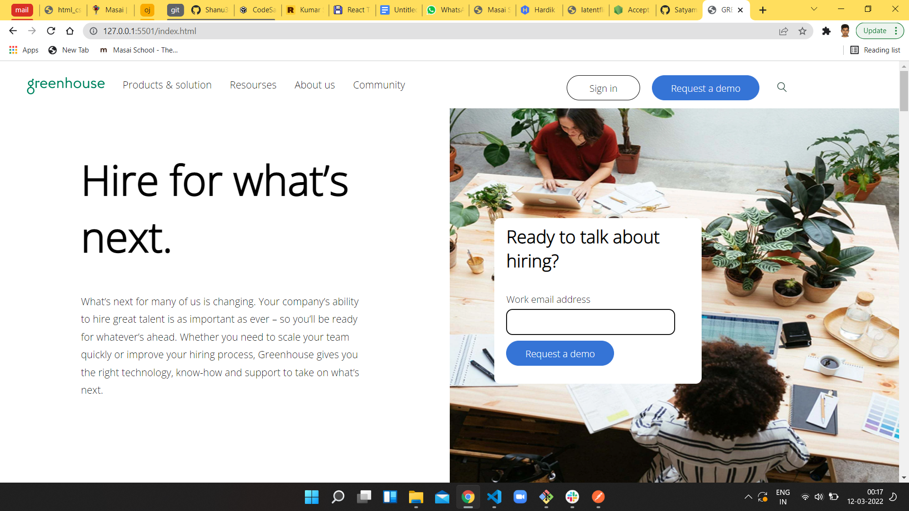
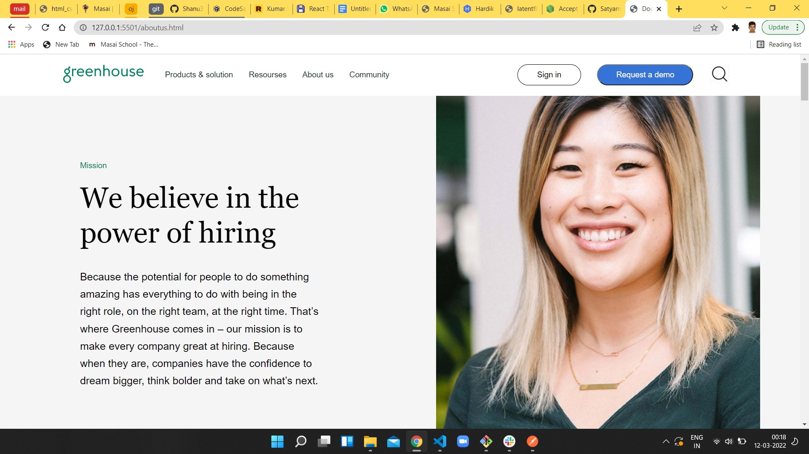
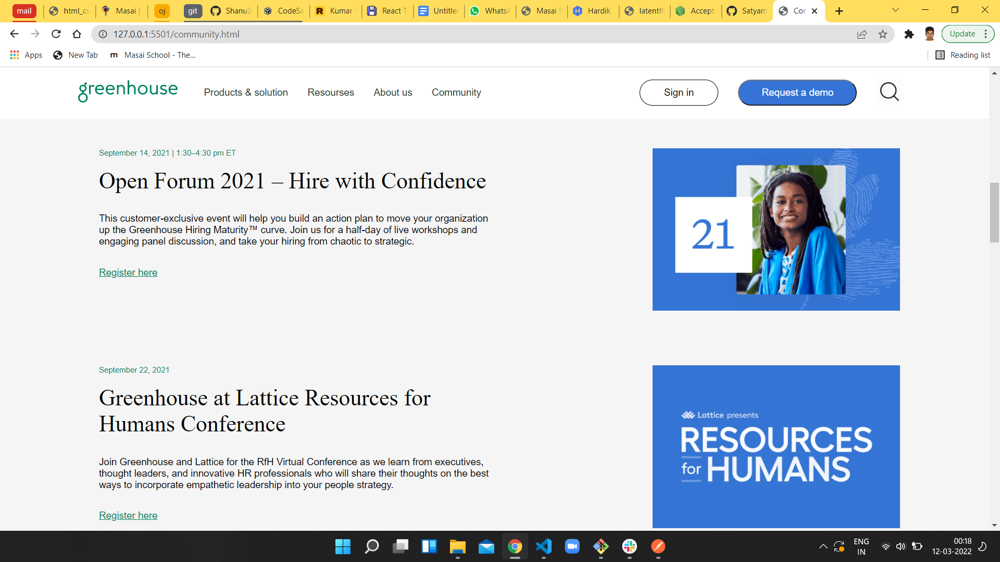
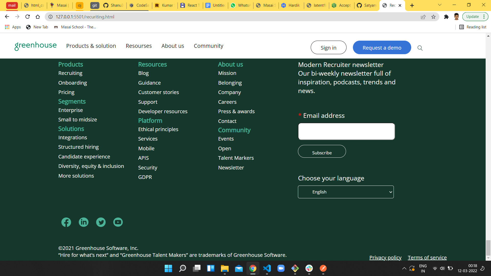

# Greenhouse-clone

<h3>About website</h3>
Greenhouse.io is an Aplicant tracking system & recruiting sofware. 

<ol >
<li>
 <h3>Landing Page</h3> 

</li>
<li>
<h3>LongStayPage</h3> 

</li>
<li>
<h3>Book Your Stay Page</h3> 

</li>
<li>
<h3>Confirm Booking Page</h3> 

</li>

</ol>

## Technologies used :-
1) CSS
2) HTML
3) JavaScript

## Contributions:-

### Satyaprakash  [GitHub](https://github.com/Satyamall) - [LinkedIn](https://www.linkedin.com/in/satya-prakash-mall-125649216/)

### Anish  [GitHub](https://github.com/skant-2000) - [LinkedIn](https://www.linkedin.com/in/anish-tewari-5a5050215/)

### Shanu [Github](https://github.com/Shanu30) - [LinkedIn](https://www.linkedin.com/in/kumar-shanu-a73636140)

